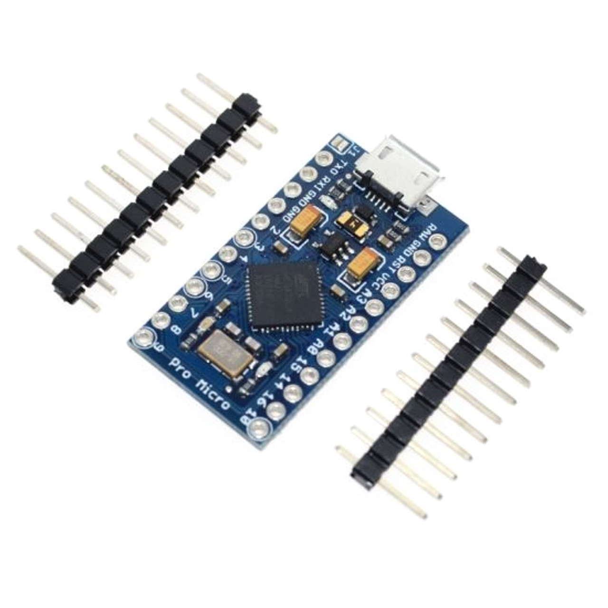

# Arduino Pro Micro Bad USB

## How to Use an Arduino Pro Micro as a Bad USB

- Purchase an Arduino Pro Micro (Clone) like this: ([Pro Micro with Atmega32U4 chip Development Board](https://a.co/d/aajqI4v))
- USB to USB-C data cable like this: ([3-2ft USB to USB-C](https://a.co/d/4LSTE2W))
- USB-C to USB-C data cable like this: ([3-2ft USB to USB-C]( https://a.co/d/4n8lFru))
