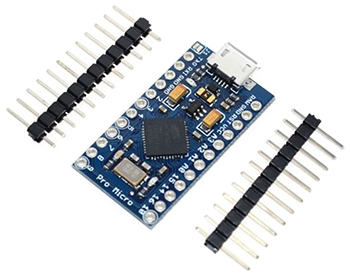

# Arduino Pro Micro Bad USB

## How to Use an Arduino Pro Micro as a Bad USB

- Purchase an Arduino Pro Micro (Clone) like this: ([Pro Micro with Atmega32U4 chip Development Board](https://a.co/d/aajqI4v))
- USB to USB-C data cable like this: ([3-2ft USB to USB-C](https://a.co/d/4LSTE2W)) or
- USB-C to USB-C data cable like this: ([3-2ft USB to USB-C]( https://a.co/d/4n8lFru))

## Setup PlatformIO on VSCode

1. Install [VSCode](https://code.visualstudio.com/)
2. Open VS Code.
3. Go to the Extensions view (Ctrl+Shift+X).
4. Search for "PlatformIO IDE".
5. Click "Install" on the PlatformIO IDE extension.
6. After installation, reload VS Code if prompted.
7. You will see a PlatformIO icon in the sidebar. Click it to open PlatformIO Home.
8. Use PlatformIO Home to create or open projects, configure boards, and manage libraries.
9. Open your project folder (e.g., `AutoRickroll`) in VS Code.
10. Use the PlatformIO toolbar at the bottom or sidebar to build, upload, and monitor your project.

## Ducky Script Converters

- [Ducky Script to Arduino Converter](https://github.com/htr-tech/ducky)
